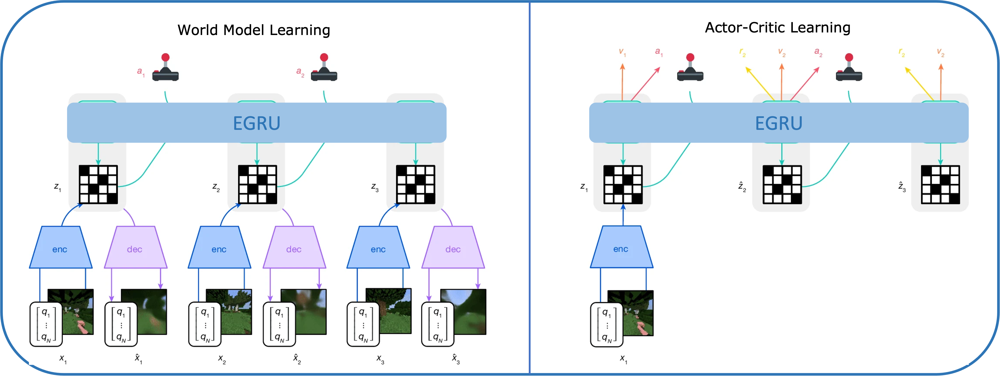
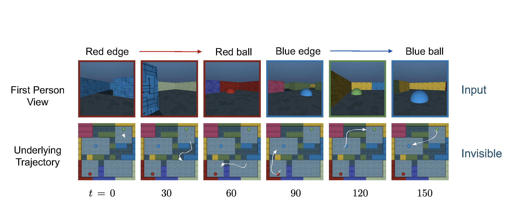
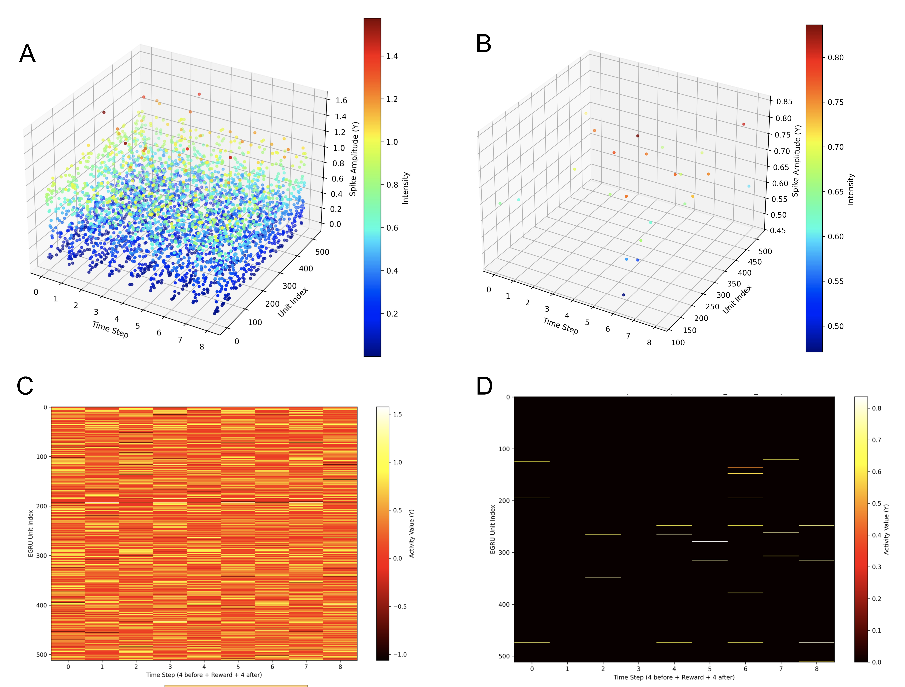

# Event-based Recurrent Architecture in World Model Learning
This repository implements an event-based version of the Dreamer v3 world model by replacing the standard Gated Recurrent Unit (GRU) with an Event-based GRU (EGRU). This exploration aims to improve the computational efficiency of World Model Learning in Reinforcement Learning (RL) tasks through sparse activation patterns.

## Overview
Reinforcement Learning within a World Model framework (like Dreamer v3) has shown impressive results but suffers from high computational costs due to dense recurrent updates. This project integrates EGRU[3], which utilizes a thresholding mechanism to produce sparse, spike-like activations.

Key Findings:
* Extreme Sparsity: The EGRU achieved an activation sparsity of 99% compared to GRU's 26% in the Memory Maze task.
* Functional Representation: Despite high sparsity, the activation patterns remain informative and regular, effectively guiding the agent toward rewards.
* Feasibility: Initially validates that event-based structures can sustain learning in complex 3D navigation tasks.

## Architecture
<p align="center">

<br>
<em>Figure 1: Training process of Dreamer v3 with integrated EGRU.[1]</em>
</p>

## Task: Memory Maze[2]
We evaluate the model on the Memory Maze (9x9) benchmark, a challenging 3D navigation task that requires long-term memory and spatial reasoning.
<p align="center">

</p>
Agent Demonstration (Video)
<p align="center">

</p>

## Results
Activation Sparsity Visualization
Comparison of neuronal activity between GRU (Dense) and EGRU (Sparse) during reward-seeking phases.
<p align="center">

</p>

## Repository Structure
```
.
├── Model.py                 # Entry point for training
├── dreamer.py               # Core Dreamer v3 implementation
├── EGRU.py                  # Event-based GRU implementation
├── Networks.py              # Architectures of sub-modules
├── Utils.py                 # Utility functions. e.g., replay buffer and loss functions
├── images/                  # Figures and media used in README
├── conf/                    #Hyperparameters
└── README.md
```

## Credits
This project stands on the shoulders of giants. Special thanks to:

- [DreamerV3](https://github.com/Eclectic-Sheep/sheeprl)

## References
[1] Hafner, D., Pasukonis, J., Ba, J., & Lillicrap, T. (2025). Mastering diverse control tasks through world models. Nature, 640(8059), 647–653. 

[2] Pasukonis, J., Lillicrap, T., & Hafner, D. (2022). Evaluating long-term memory in 3D mazes (arXiv:2210.13383). arXiv.

[3] Subramoney, A., Nazeer, K. K., Schöne, M., Mayr, C., & Kappel, D. (2023). Efficient recurrent architectures through activity sparsity and sparse back-propagation through time.
